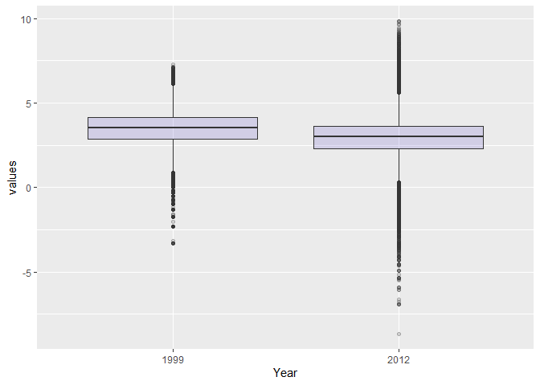

Synopsis
========

In this short report we aim to describe changes fine particle
(PM2.5) air pollution in the U.S between 1999 and
2012. We hypothesize that the PM2.5 has decreased
on average across the U.s due to regulatory requirements. To investigate
this hypothesis we obtained data from the U.S. Environmental Protection
Agency (EPA) which is collected from monitors across the U.S.
Specifically, we obtained data from the years 1999 and 2012. From this
data found found that, on average, levels of PM2.5
have decreased between 1999 and 2012. Most individual states also saw
decreases in PM2.5, although some saw increases.
At an individual monitor, we found levels had decreased and were less
volatile.

Loading and Processing the Raw Data
===================================

Reading the 1999 data
---------------------

We read in the 1999 data, we leave out the variable names and header for
now and specify that the separation character is “|” and missing values
are coded as empty strings.

    pm99 <- read.table("1999.txt", comment.char = "#", 
                      header = FALSE, sep = "|", na.strings = "")

After reading the 1999 data we check the dimensions to see the number of
rows and columns.

    dim(pm99)

    ## [1] 117421     28

We Take a look at the first 6 rows in the first 10 variables to get a
feel for the data

    head(pm99[,1:10])

    ##   V1 V2 V3 V4 V5    V6 V7 V8  V9 V10
    ## 1 RD  I  1 27  1 88101  1  7 105 120
    ## 2 RD  I  1 27  1 88101  1  7 105 120
    ## 3 RD  I  1 27  1 88101  1  7 105 120
    ## 4 RD  I  1 27  1 88101  1  7 105 120
    ## 5 RD  I  1 27  1 88101  1  7 105 120
    ## 6 RD  I  1 27  1 88101  1  7 105 120

Next we attach the Variable names to our dataframe.

    col_names <- readLines("1999.txt",1)
    col_names <- strsplit(col_names,"|",fixed = T)
    names(pm99) <- make.names(col_names[[1]]) #Makes valid names out the character vector col_names[[1]]
    head(pm99[,1:7])

    ##   X..RD Action.Code State.Code County.Code Site.ID Parameter POC
    ## 1    RD           I          1          27       1     88101   1
    ## 2    RD           I          1          27       1     88101   1
    ## 3    RD           I          1          27       1     88101   1
    ## 4    RD           I          1          27       1     88101   1
    ## 5    RD           I          1          27       1     88101   1
    ## 6    RD           I          1          27       1     88101   1

The column we are interested in is the Sample.Value column which
contains the PM2.5 measurements.We print a brief
summary.

    pm99_values <- pm99$Sample.Value
    summary(pm99_values)

    ##    Min. 1st Qu.  Median    Mean 3rd Qu.    Max.    NA's 
    ##    0.00    7.20   11.50   13.74   17.90  157.10   13217

From the summary we see there are missing values, we look at the
proportion of the measurements that are missing for Sample.Value.

    mean(is.na(pm99_values))

    ## [1] 0.1125608

Approximately 11.26% missing is relatively low, so we choose to ignore
the missing values for now.

Reading the 2012 data
---------------------

We read the data from 2012 in the same way and preform the same
exploratory commands.

     pm12 <- read.table("2012.txt", comment.char = "#", 
                      header = FALSE, sep = "|", na.strings = "")

    names(pm12) <- make.names(col_names[[1]])

    dim(pm12)

    ## [1] 1304287      28

    pm12_values <- pm12$Sample.Value
    summary(pm12_values)

    ##    Min. 1st Qu.  Median    Mean 3rd Qu.    Max.    NA's 
    ##  -10.00    4.00    7.63    9.14   12.00  908.97   73133

    mean(is.na(pm12_values))

    ## [1] 0.05607125

We see less missing values from the 2012 data only 5.61%

Note also the PM2.5 values have a large positive
skew in both 1999 and 2012

Results
=======

Entire U.S. analysis
--------------------

For the visualizing our results we will the ggplot2 and GGally packages.

    library(ggplot2)
    library(GGally)

To show changes in PM2.5 across all monitors, we
take the log of the values to account for the skew and make boxplots.

    boxplot_data<- rbind(data.frame(values=pm99_values,year="1999"),data.frame(values=pm12_values,year="2012"))
    boxplot_data$values <- log2(boxplot_data$values)

    ## Warning: NaNs produced

    ggplot(data=boxplot_data,aes(x=as.factor(year),y=values))+geom_boxplot(fill="slateblue", alpha=0.2)+xlab("Year")

    ## Warning: Removed 143164 rows containing non-finite values (stat_boxplot).

    summary(pm12_values)

    ##    Min. 1st Qu.  Median    Mean 3rd Qu.    Max.    NA's 
    ##  -10.00    4.00    7.63    9.14   12.00  908.97   73133

Firstly we can see from 1999 to 2012 the median
PM2.5 has gone down as have the Q1 and
Q3 values. From both the summary and the boxplot we notice
that there were negative values for PM2.5 recorded
in 2012.These should not occur and we will investigate these now.

    negative <- pm12_values <0
    mean(negative,na.rm=T)

    ## [1] 0.0215034

The proportion of negative values is relatively small. We now extract
the date of each measurement from the original data frame to give us an
idea of when these negative values are occurring. To do this we need the
data formatted in Date format.

    dates <- pm12$Date
    dates <- as.Date(as.character(dates), "%Y%m%d")

Now we produce a table that shows in what month what percentage of the
negative values were recorded.

    missing.months <- month.name[as.POSIXlt(dates[negative])$mon + 1] 
    tab <- table(factor(missing.months, levels = month.name)) # produces a table with total number of negative oberavtions by month
    round(100 * tab/sum(tab)) 

    ## 
    ##   January  February     March     April       May      June      July    August September   October  November  December 
    ##        20        15        16        14        11        15         3         3         2         0         0         0

This shows over 90% of all negative measurements of
PM2.5 occur in the first 6 months of the year.

Changes in state-wide PM levels
===============================

It is useful to compare PM2.5 levels by state
since the reduction and management of PM2.5 is
left to the individual states. Here we calculate the mean
PM2.5 for each state in 1999 and 2012.

    #calcuate the mean by state
    mean99 <- with(pm99,tapply(Sample.Value,State.Code,mean,na.rm=T))
    mean12 <- with(pm12,tapply(Sample.Value,State.Code,mean,na.rm=T))
    #make seprate dataframes
    df_99 <- data.frame(state=names(mean99),mean=mean99)
    df_12 <- data.frame(state=names(mean12),mean=mean12)

    mrg <- merge(df_99,df_12,by="state")
    head(mrg)

    ##   state    mean.x    mean.y
    ## 1     1 19.956391 10.126190
    ## 2    10 14.492895 11.236059
    ## 3    11 15.786507 11.991697
    ## 4    12 11.137139  8.239690
    ## 5    13 19.943240 11.321364
    ## 6    15  4.861821  8.749336

Now we plot the points that represent the means of each
PM2.5 measurement for each year and join the
points to show an increase or decrease in PM2.5.

    names(mrg) <- c("State","1999","2012")
    ggparcoord(mrg,
        columns = 2:3,
        showPoints = TRUE, 
        title = "Mean PM2.5 in each state",
        scale="globalminmax",
        alphaLines = 0.3
        ) + ylab("State-wide Mean PM2.5")+xlab("Year")

 From
the plot above we can see that most states have decreased the average
PM2.5 levels.

Changes in PM levels at an individual monitor
---------------------------------------------

One issue with the previous analysis is that monitoring locations could
have changed in the time period between 1999 and 2012. So if for some
reason in 2012 there are more monitors concentrated in cleaner parts of
the country/State than there were in 1999, it might appear the
PM2.5 levels decreased when they didn’t. In this
section we will focus on a single monitor in New York State to see if
PM2.5 levels at that monitor decreased from 1999
to 2012.

Firstly we find a monitor in New York State that has data from both
datasets. We subset the dataframes to only include results recorded in
New York (State Code==36), furthermore we only want County.Code and
Site.ID as our variables.

    site99 <- unique(subset(pm99, State.Code == 36, c(County.Code, Site.ID)))
    site12 <- unique(subset(pm12, State.Code == 36, c(County.Code, Site.ID)))

From these subsets we create a new vector that is a combination of our
selected variables (County.Code and Site.ID) separated by ‘.’.

    site99 <- paste(site99[, 1], site99[, 2], sep = ".")
    site12 <- paste(site12[, 1], site12[, 2], sep = ".")

    str(site99)

    ##  chr [1:33] "1.5" "1.12" "5.73" "5.80" "5.83" "5.110" "13.11" "27.1004" "29.2" "29.5" "29.1007" "31.3" "47.11" "47.76" "55.6001" "59.5" "59.8" "59.11" ...

    str(site12)

    ##  chr [1:18] "1.5" "1.12" "5.80" "5.133" "13.11" "29.5" "31.3" "47.122" "55.1007" "61.79" "61.134" "63.2008" "67.1015" "71.2" "81.124" "85.55" "101.3" "103.2"

So the intersection of these 2 vectors is all of the monitors that are
in New York State that have data from 1999 and 2012

    both <- intersect(site12,site99)
    print(both)

    ##  [1] "1.5"     "1.12"    "5.80"    "13.11"   "29.5"    "31.3"    "63.2008" "67.1015" "85.55"   "101.3"

We see that there are 10 monitors.Rather than choose one at random, it
would best to choose one that had a reasonable amount of data in each
year.

    # adds the vectors above as a new variable (county.site) on the respective dataframes
    pm99$county.site <- with(pm99, paste(County.Code, Site.ID, sep = ".")) 
    pm12$county.site <- with(pm12, paste(County.Code, Site.ID, sep = "."))
    #subsets by all county.site which appear in the intersection and are in the state of New York
    count99 <- subset(pm99, State.Code == 36 & county.site %in% both)
    count12 <- subset(pm12, State.Code == 36 & county.site %in% both)

Now that we have subset the original data frames to only include the
data we are interested in, we can split the data frames and count the
number of observations at each monitor to see which ones have the most
observations and will be the most useful to compare.

    sapply(split(count99, count99$county.site), nrow)

    ##    1.12     1.5   101.3   13.11    29.5    31.3    5.80 63.2008 67.1015   85.55 
    ##      61     122     152      61      61     183      61     122     122       7

    sapply(split(count12, count12$county.site), nrow)

    ##    1.12     1.5   101.3   13.11    29.5    31.3    5.80 63.2008 67.1015   85.55 
    ##      31      64      31      31      33      15      31      30      31      31

From these outputs we can see that most monitors have a suitable amount
of observations, we will use county.site==36.2008

    pm99sub <- subset(pm99,State.Code==36 & county.site==63.2008)
    pm12sub<- subset(pm12,State.Code==36 & county.site==63.2008)

Now we need to combine these dataframes into one and add a factor
indicating the year.

    temp_99<- data.frame(values=pm99sub$Sample.Value,date=pm99sub$Date,year="1999")
    temp_12<- data.frame(values=pm12sub$Sample.Value,date=pm12sub$Date,year="2012")
    plot_data <- rbind(temp_99,temp_12)
    plot_data$date <- as.Date(as.character(plot_data$date),"%Y%m%d")

And now we plot the time series of this data to compare the
PM2.5 levels from the monitor from 1999 to
2012,drawing lines on the y axis at the median for each year.

    ggplot(data=plot_data,aes(x=date,y=values,na.rm=T))+geom_point()+facet_wrap(.~year,scales="free") +ylim(c(0,40))+ylab("PM2.5")+geom_hline(data=subset(plot_data,year==1999),aes(yintercept=median(values,na.rm=T)))+geom_hline(data=subset(plot_data,year==2012),aes(yintercept=median(values,na.rm=T)))

    ## Warning: Removed 36 rows containing missing values (geom_point).

